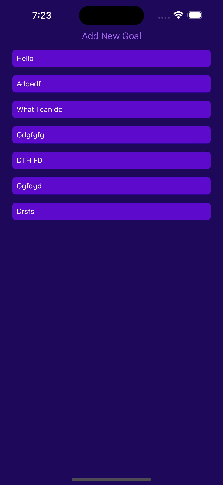
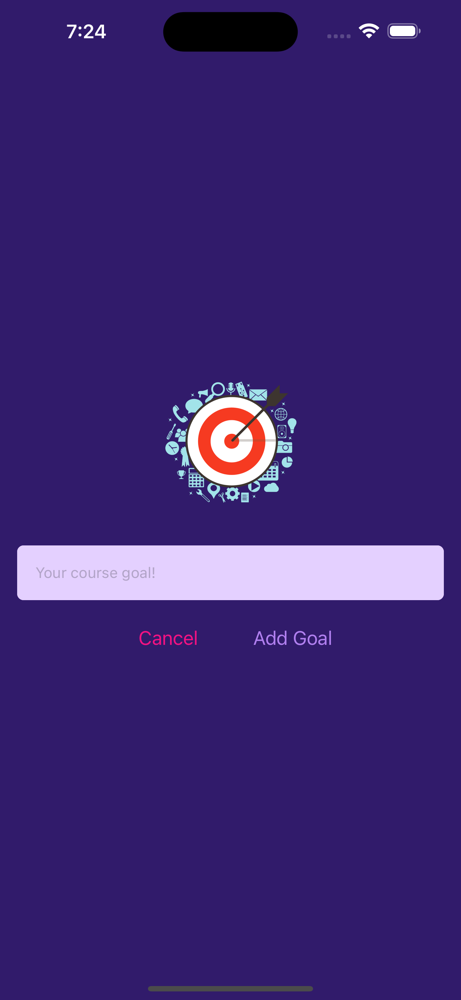

# React Native Goals Todo App

## Overview

This is a simple mobile application built with React Native to help users manage their goals and todos efficiently. The app allows users to create, update, and delete goals, making it a handy tool for staying organized and productive.

## Features

- **Create Goals:** Easily add new goals with a title and description.
- **Update Goals:** Modify existing goals to keep your tasks up-to-date.
- **Delete Goals:** Remove completed or unnecessary goals.

## Screenshots

Include a few screenshots or GIFs demonstrating the app's user interface and key features.




## Acknowledgements

- [ReactJS](https://react.dev)
- [React Native](https://reactnative.dev/)
- [Expo](https://expo.dev/)

## How to Start the Project

Follow these steps to run the Goals-todo on your local machine:

**Note**: Make sure Android studio install in your local machine then using android emulator run app on your emulator.

1. **Clone the Repository**:
   Clone this repository to your local machine using the following command:

   ```bash
   git clone https://github.com/kabhinav577/goals-todo-react-native.git
   ```

2. Navigate to the Project Directory:

   ```
   cd goals-todo-react-native

   ```

3. Install Dependencies:

   ```
   npm install

   ```

4. Start the Development Server:
   ```
   npm start
   ```
5. Access the App:
   Download Expo go from play store and Scan **Expo Qr Code** in Expo go app.

## Authors

- [@krishna Kant singh](https://krishnakant-singh.vercel.app/)
